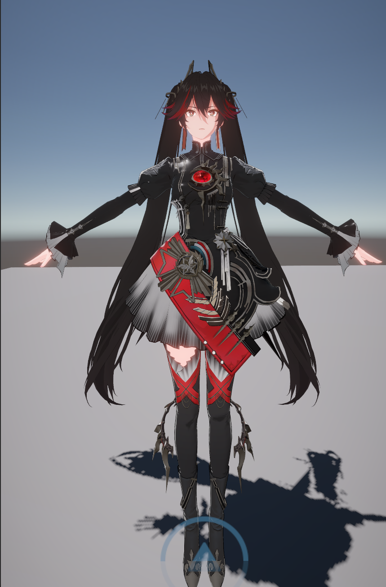
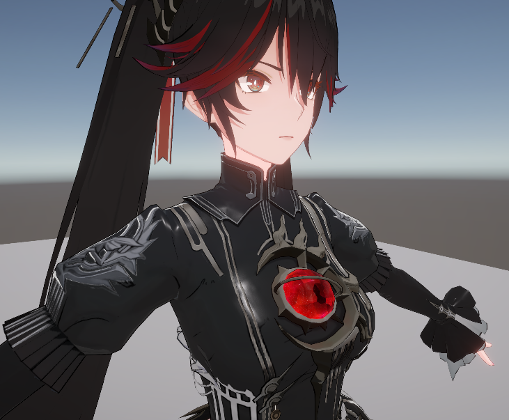

# PGR Character Rendering

基于 Unity URP 的《战双帕弥什》角色渲染还原项目，当前内容为露西亚·誓焰【光耀颂赞】的角色表现整理与还原。仓库内包含角色资源、示例场景、材质配置与自定义 Shader，方便直接打开工程查看效果。

## 效果预览

## 运行环境

- Unity `2022.3.61t8`
- Universal Render Pipeline `14.1.0`

## 当前内容

- 角色资源、场景与材质已整理到可直接运行的 Unity 工程中
- 自定义角色渲染 Shader，覆盖面部、眼睛、头发、服装与 upper 材质
- 针对 upper 区域做了对比度与间接光表现的调整，改善原本层次偏灰的问题
- 保留了工程运行所需的 URP 配置、依赖包与示例资源

## 目录结构

- `Assets/Scenes/SampleScene.unity`：示例场景
- `Assets/露西亚 誓焰 光耀颂赞/`：角色模型、贴图、材质、脚本与自定义 Shader
- `Assets/Settings/`：URP 相关资源与 Renderer 配置
- `Packages/`：Unity 包依赖
- `ProjectSettings/`：项目设置

## 使用方式

1. 使用 Unity Hub 打开本项目
2. 选择 Unity `2022.3.61t8`
3. 打开 `Assets/Scenes/SampleScene.unity`
4. 在 `Scene` 或 `Game` 视图中查看角色渲染效果

## 说明

本仓库主要用于角色渲染研究、效果整理与工程归档。
